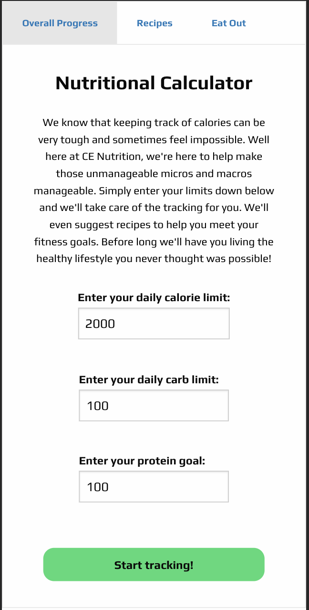

# test1

My Fitness Buddy

This app has three main pieces of user interaction/functionality:

    1) "Overall Progress" tab contains initial user setup where the user will enter their daily calorie and carb limit and their daily protein goal.
    
        - This info is saved to the user's local storage and drives progress bars showing the daily progress.
        - The progress bars are refreshed at midnight everynight, but the initial user setup (limits and goals) persist.

    2) "Recipes" tab gives the user the ability to find recipes and associated nutritional info based on search criteria (meal type, cuisine type, and specific craving).
        - Once a user chooses the recipe they are shown the nutritional info and given a link to the recipe site
        - If the use chooses the "Select this recipe and update tracker" button, a modal displays the the nutitional info and the user must input the serving size that they consumed.
            -Once the user chooses the "Update" button, another modal displays the nutritional info based on the user's serving size.
            -Once the user chooses the "Submit Changes" button, the calories, carbs and protein associcated with the meal are fed into the progress bar on the Overall Progress tab.
    
    3) "Eat Out" tab gives the user the ability to find local restaurants based on search criteria (address, maximum distance, specific craving)
        - Once the user chooses a restaurant, they are presented with contact info for that restaurant
        - Once the user clicks off the tab, a modal is displayed to remind the user to check the nutritional info of the food and to manually update the Overall Progress tab

